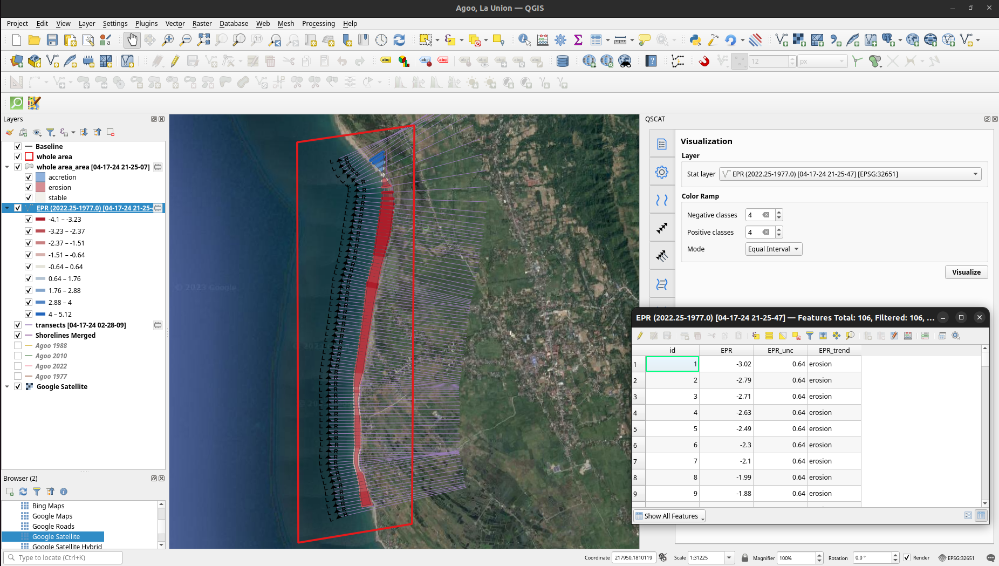

## Hi, I'm Louis Facun 👋

Welcome to my GitHub profile.

- 🏢 I'm an aspiring Full Stack Web Developer.
- 💬 Ask me about anything, I am happy to help.
- 📫 How to reach me: louisfacun@gmail.com

🧬 Projects
------------

| Project | |
|:-----|---------|
  |   </img>    A QGIS plugin for shoreline change analysis.    • Main language: `Python` • Core functions: `PyQGIS API` • GUI: `PyQt5` • Extra: `NumPy` • Tests: `pytest`, `unittest` (`patch`), `qgis.testing` (`get_iface`, `startapp`) • Docs: `Sphinx` @ `GitHub Pages`    **[> Browse](https://github.com/louisfacun/qscat)**   |  |

<!--

 -->
